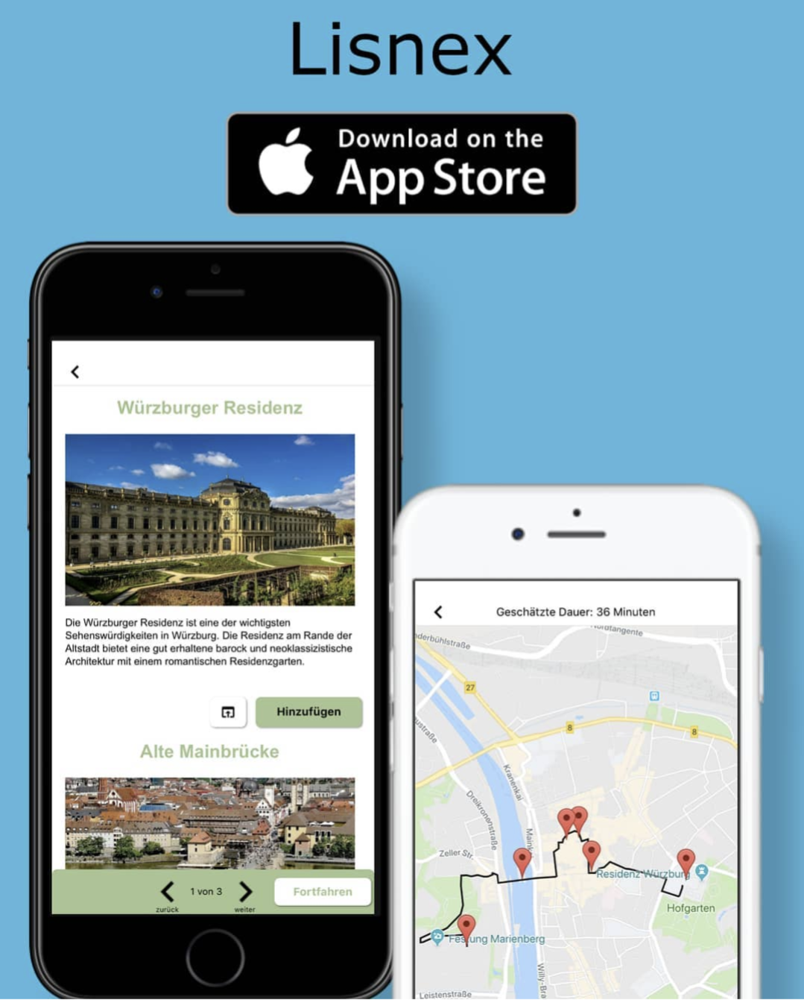

# Lisnex

[Demo Video](https://www.dropbox.com/scl/fi/dz6yqzcuz8s8y2qxq5p9a/insta-vid.mp4?rlkey=8g1pjj5mcyxcou04me65fkn6s&dl=0/)

# How it started
Since the beginning of my IT journey I always wanted to be able to develop my own apps. When I started my masters degree in 2017 I had only little coding experience. I somehow came across a tool named [Thunkable](https://thunkable.com/). At this time Lowcode was still not really common but for me it was perfect to start learning programming. After a few learning iterations I wanted to create a proper app.

# Problem:
To be honest there was no structured process behind the idea of Lisnex but the problem I always had when travelling to a new city: what is the best way to walk in order to see selected sightseeing spots? There were tons of tools out there in this area but none which really worked like I wanted.

# Solution:
I wanted to have an app which lists famous sightseeing spots which can be added to a sightseeing route. Depending on a predefined starting point or the current GPS location the "fastest" route will be generated. The fastest route was calculated by a "nearest neighbor" approach via Google Maps API. After the route is compiled the user can start the navigation in Google Maps. In the background the app checks every 10 seconds if the current location is in a certain radius of the sightseeing spot. If yes then a computer voice will provide some information from wikipedia to the user.

# Technical Implementation:
The app development was done in Thunkable which is a Lowcode tool for creating Apple & Android apps. For all the location related things I used the Google Maps API and stored the results in Airtable. The computer voice was done via a Text-to-Speech Tool.  

# Deployment
I launched the app in the Google Play Store and Apple Store but I realized very soon that I was lacking the marketing expertise. I tried to do it on my own and even find partners but without much luck. In the end I had a few downloads ~30 on Android and ~100 on Apple.

# Lessons Learned
In general it was very fun to create the app but it also took a lot of time. Mainly because I was forced to twist a lot of things because of the way most of the Lowcode Tools work. It is very easy to start with things but as soon as it gets more complex it is just a pain: Creating a multiple page app, keeping the state of the data, making an "nearest neigbor" algorithm, keep the app in the background. This was also reflected in the performance of the app. It was very slow, clunky and also not very good looking. In the end it was a very good learning experience but I would not use a Lowcode Tool again for more complex apps.
 
Besides the technical stuff I also learned (the hard way) that development is only one part of the whole thing. Marketing & Sales is equally important to success.  
I kept the App online for almost a year but I never really got momentum. At the end of my Masters I then focused more on my thesis and eventually abandoned the project.
